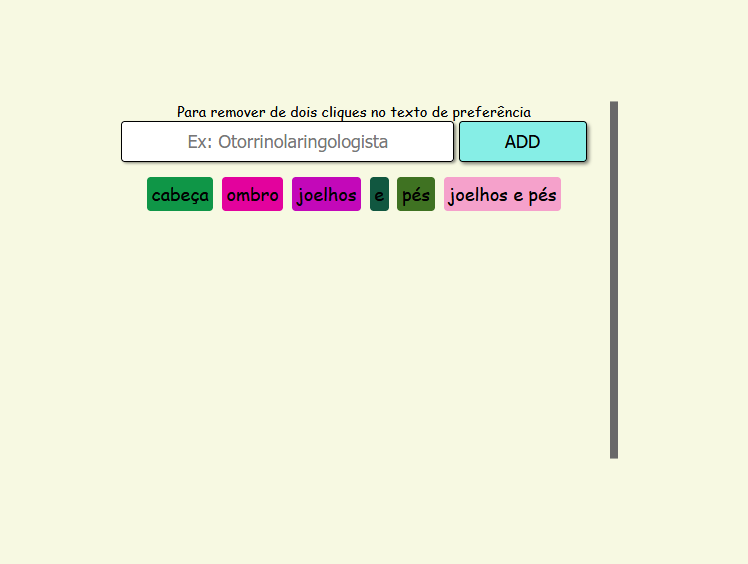

# Projeto: Adicionar ou remover caracter

Adicionar ou remover caracteres na tela usando Javascript

### Utilidade:
* Treinando Nós em JS

#### Material:
* Javascript
* CSS
* HTML

#### Modo de uso:
* Abra um terminal ( cmd/propt de comando )
* Clone o repositório ( git clone git@github.com:RobMota/add-and-remove-text-in-js-vanilla.git ) em algum local de preferência
* Acesse a pasta ( cd add-and-remove-text-in-js-vanilla )
* E abra a o arquivo index.html ( Ex: index.html ) em um navegador de sua preferência ( chrome, firefox ).

